# Pokémon Lock Screen

A lock screen plugin for [Omarchy](https://omarchy.org/) 4's Quickshell shell.
A Pokémon greets you, its types colour the card and stir the air behind it, and
your battery reads as its HP.

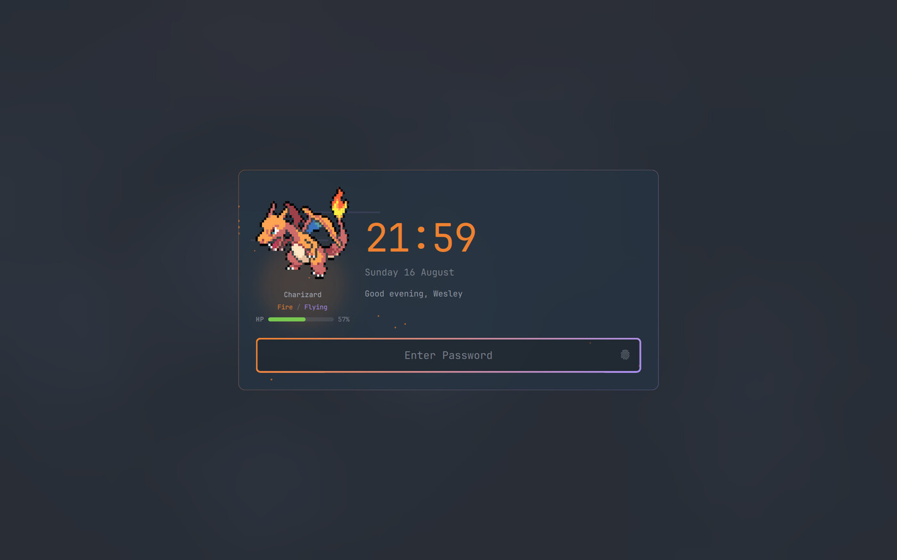

It is a clone of the stock `omarchy.lock` plugin. Everything visible is
rewritten; `Service.qml` — the session lock, the PAM flows and the fingerprint
handling — is upstream code carried verbatim.

## Features

- **A different Pokémon each lock**, drawn from `pokemon-colorscripts` ANSI art.
- **Types drive the card.** The primary type colours the clock, the sprite glow
  and the borders. Dual types make the borders a two-stop gradient.
- **Eighteen types, eighteen ambient effects.** No two share one.
- **Battery as an HP bar**, in the games' green / yellow / red. Optional.
- **Shiny rolls**, one in 128 by default, announced with a sparkle burst.
- **Follows the active Omarchy theme** — card fill, wash and text all resolve
  from the theme, light themes included. No per-theme configuration.
- **Everything is a token** in `[lock]`, themeable and overridable per machine.

## Requirements

- Omarchy 4 (Quickshell shell)
- `pokemon-colorscripts` for the sprites — without it the card simply renders
  without one

```bash
yay -S pokemon-colorscripts-git
```

## Install

```bash
git clone https://github.com/WSeubring/omarchy-lock-pokemon ~/.config/omarchy/plugins/wseubring.lock
omarchy plugin disable omarchy.lock
omarchy restart shell
```

The plugin id is `wseubring.lock`. To use your own namespace, rename the
directory and the `id` in `manifest.json` together.

Preview it without locking the session:

```bash
qs -p /usr/share/omarchy/shell ipc call lock preview
qs -p /usr/share/omarchy/shell ipc call lock hidePreview
```

Plugin changes need `omarchy restart shell`. Never restart the shell while the
session is locked — the lock client dies and Hyprland falls back to its
recovery screen.

## Gallery

Ambient effects, one per type:

| electric | ice | psychic |
|---|---|---|
| 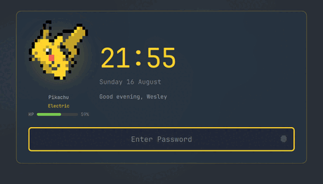 | 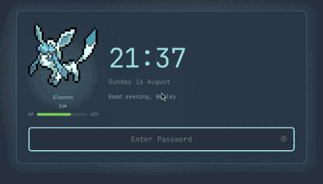 | 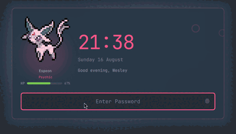 |
| lightning strikes | drifting flakes | expanding ripples |

| rock | dragon | poison |
|---|---|---|
| 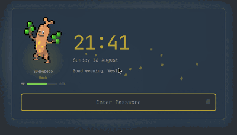 | 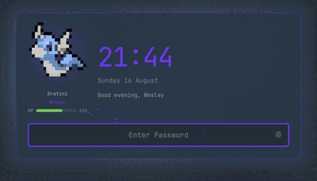 | 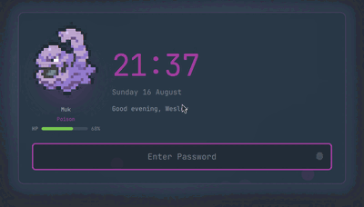 |
| orbiting rubble | inward vortex | creeping smog |

The rest: embers (fire), bubbles (water), leaves (grass), wisps (ghost),
twinkles (fairy), grit (ground), gusts (flying), shockwave rings (fighting),
flit (bug), pools (dark), plates (steel), motes (normal). Flying also hovers
the sprite, electric flicks the card edge, ground rumbles the card.

Dual types layer the second type's effect behind the first:

| Gengar · ghost over poison | Venusaur · grass over poison |
|---|---|
| 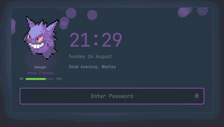 | 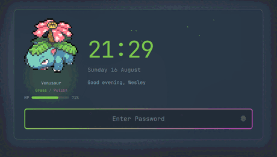 |

A shiny, and the battery gauge:

| 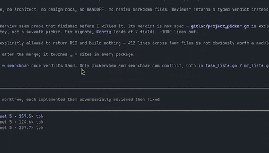 | 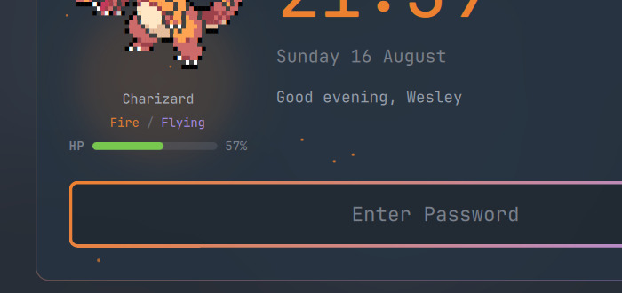 |
|---|---|

The same card under four Omarchy themes:

| Tokyo Night | Rosé Pine |
|---|---|
| 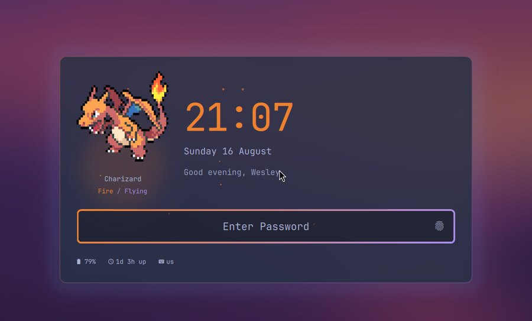 | 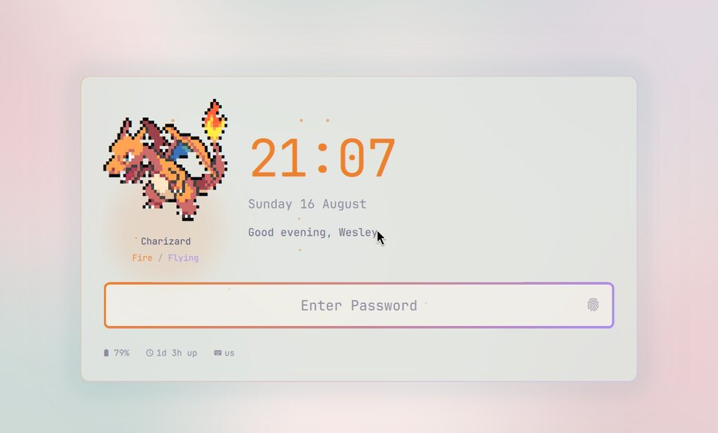 |

| Everforest | Catppuccin Latte |
|---|---|
| 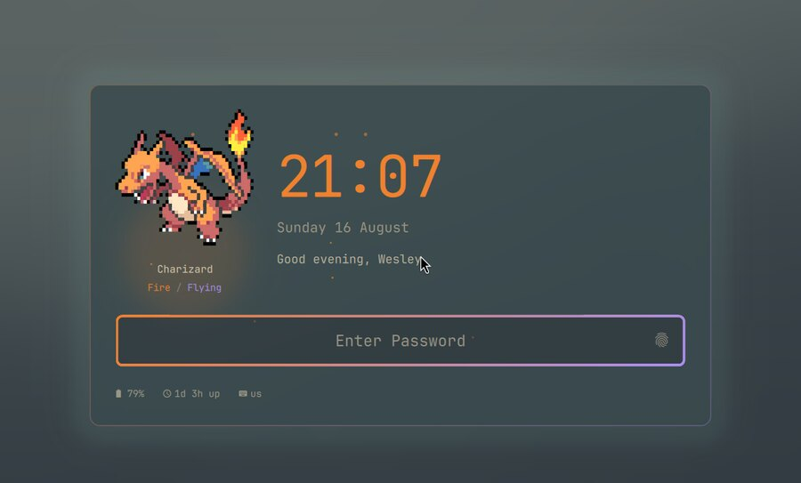 | 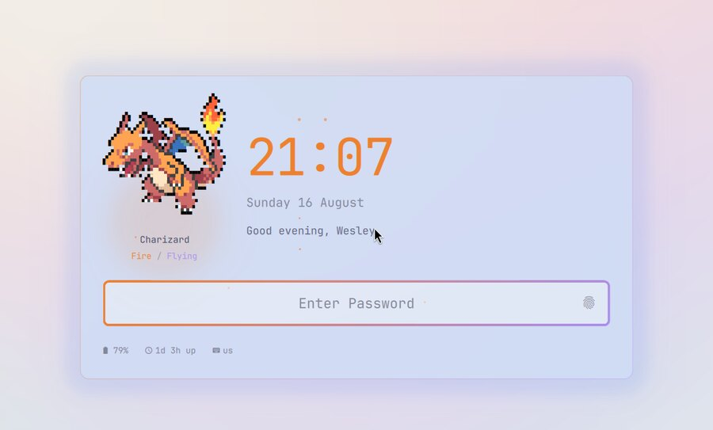 |

Clock placements — `card`, `ghost`, `corner`, `clock-above`, and `hero`:

| 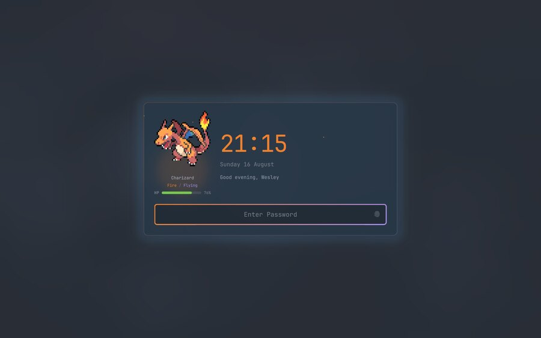 | 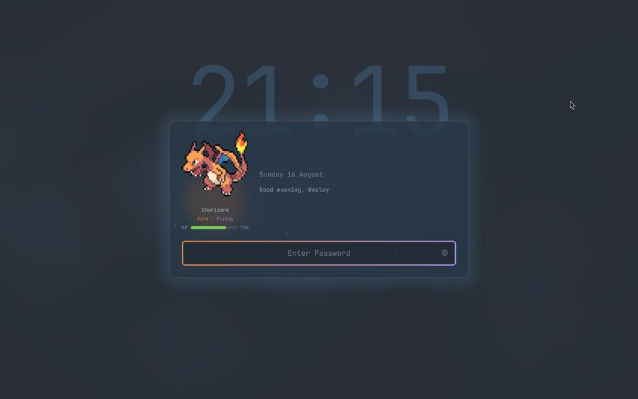 |
|---|---|
| 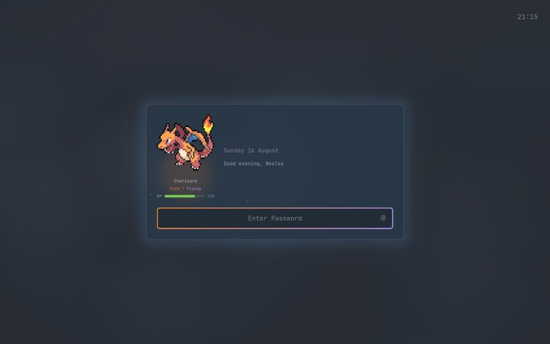 | 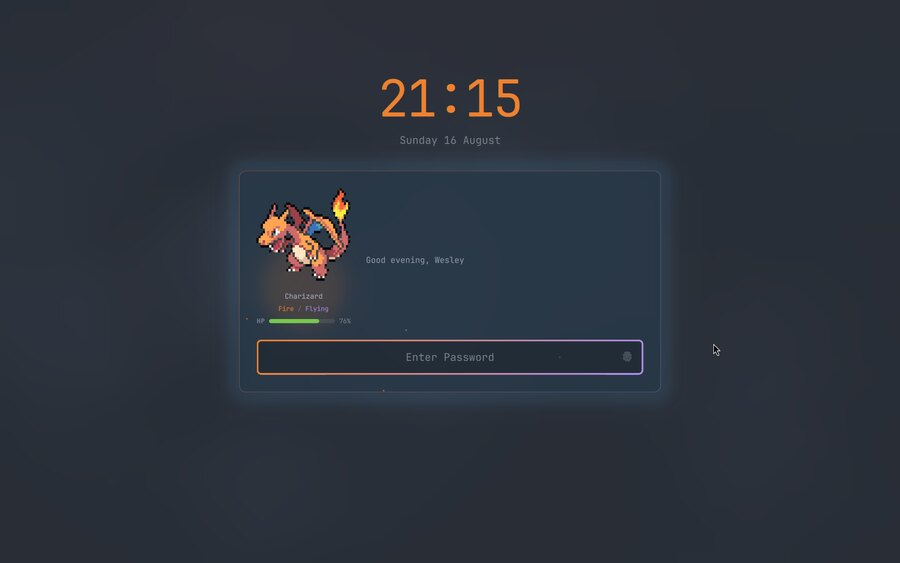 |

## Configuration

All settings live in the `[lock]` section of shell.toml. The shell merges the
current theme's generated file with `~/.config/omarchy/shell.toml` on top:

- **Per theme** — `~/.config/omarchy/themes/<slug>/shell.lock.toml`. This
  replaces the whole `[lock]` block, so repeat every key you want to keep.
- **Per machine** — `[lock]` in `~/.config/omarchy/shell.toml`, which wins over
  the theme for the keys it names.

Unset keys fall back to palette-derived defaults, so the plugin looks right
under a theme that says nothing about the lock screen.

```toml
[lock]
layout = "ghost"
greeting-text = "{pokemon} welcomes you back, {name}"
pokemon-generations = "1-3"
shiny-odds = 4096
battery-style = "hide"
```

### Layout

| Key | Default | Description |
| --- | --- | --- |
| `layout` | `card` | `card`, `clock-above`, `hero`, `ghost`, `corner` |
| `card-width` | `min(720, 55%)` | Card width in px |
| `card-padding` · `card-alpha` | `30` · `0.82` | Inset and opacity |
| `card-tint` | `0.14` | Theme accent mixed into the card fill |
| `tint-source` | `theme` | `theme` accent, or the Pokémon's with `type` |
| `card-glow` | `0.25` | Halo of the tint colour behind the card |
| `border-emphasis` | `card-quiet` | `even`, `card-quiet`, `soft-card`, `split`, `state` |
| `field-height` | `60` | Password field height |
| `blur` | `1.0` | Wallpaper blur; `0` leaves it sharp |
| `scrim-color` · `scrim-alpha` | theme background · `0.5` | Wash over the wallpaper |

### Text

| Key | Default | Description |
| --- | --- | --- |
| `clock` · `date` · `greeting` · `status` | `show` | Section toggles |
| `clock-format` · `date-format` | `HH:mm` · `dddd d MMMM` | Qt date formats |
| `clock-size` · `date-size` · `greeting-size` · `status-size` | from `[font]` | px |
| `clock-color` | type accent | `date-color`, `greeting-color`, `status-color` follow the theme |
| `user-name` | GECOS, else login | Name used in the greeting |
| `greeting-text` | time of day | Supports `{name}` and `{pokemon}` |
| `ghost-opacity` · `ghost-scale` | `0.2` · `3.4` | Watermark clock in `ghost` layout |

### Pokémon

| Key | Default | Description |
| --- | --- | --- |
| `pokemon` · `pokemon-label` | `show` | Sprite, and its name and type line |
| `pokemon-name` | random | Pin one, e.g. `pikachu` |
| `pokemon-generations` | all | `pokemon-colorscripts` range, e.g. `1-3` |
| `pokemon-size` · `pokemon-height` | `12` · `170` | Glyph px, and px the sprite fits into |
| `pokemon-shiny` | `auto` | `auto` rolls the odds, or `always` / `false` |
| `shiny-odds` | `128` | One lock in this many is shiny |
| `shiny-color` | `#ffd452` | Sparkle, glow and tag colour |

### Effects

| Key | Default | Description |
| --- | --- | --- |
| `pokemon-types` | `show` | Type colours on clock, glow and borders |
| `pokemon-effects` | `show` | Ambient motion and per-type traits |
| `effect-intensity` | `1.0` | Scales shape counts; `0` disables |
| `effect-variant` | `1` | `1` calm, `2` busy, `3` bold |
| `effect-variant-<name>` | — | Same, for a single effect |
| `effect-<type>` | per type | Reassign a type, e.g. `effect-electric = "sparks"` |
| `dual-effects` | `show` | Layer the second type's effect behind the first |
| `dual-effect-strength` | `0.55` | Density of that second layer |

### Battery

| Key | Default | Description |
| --- | --- | --- |
| `battery-style` | `hp-bar` | `hp-bar`, `text`, or `hide` |
| `hp-colors` | `hp` | Games' palette, or `theme` for the accent |
| `status-items` | *(empty)* | Extra strip entries: `uptime`, `keyboard` |
| `status-gap` | `22` | Spacing in px |

The stock `[lock]` colour keys (`background`, `text`, `placeholder`,
`text-error`, `border`, `border-active`, `border-error`, `border-alpha`,
`selection`) behave exactly as on the built-in lock screen.

## Architecture

| File | Contents |
| --- | --- |
| `Service.qml` | Upstream Omarchy: session lock, PAM, fingerprint, idle |
| `LockView.qml` | Card layout and every `[lock]` token |
| `Ambient.qml` | The nine motions the effects are built from |
| `Effects.js` | Tuning for all eighteen effects, plus intensity variants |
| `Types.js` | Type to colour, effect and trait |
| `Ansi.js` | ANSI half-block art to QML rich text |
| `HpBar.qml` · `ShinySparkle.qml` | Battery gauge and shiny burst |
| `types.json` | `pokemon-colorscripts` names to types, from PokéAPI |

Motion is hand-written QtQuick animation rather than `QtQuick.Particles`: a
lock screen needs a dozen slow shapes, not a particle system, and this keeps
the plugin on plain QtQuick imports.

When Omarchy updates its lock plugin, reconcile the upstream half:

```bash
diff -u /usr/share/omarchy/shell/plugins/lock/Service.qml Service.qml
```

## Credits

Sprites from [pokemon-colorscripts](https://gitlab.com/phoneybadger/pokemon-colorscripts).
Type data from [PokéAPI](https://pokeapi.co/). Lock plumbing from
[Omarchy](https://omarchy.org/). MIT licensed — see [LICENSE](LICENSE).
