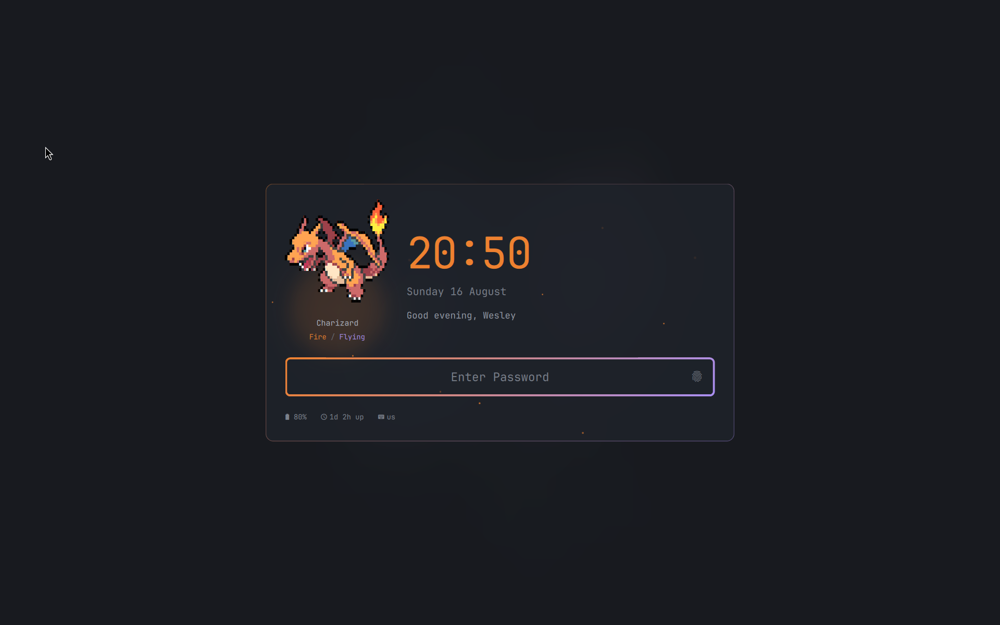
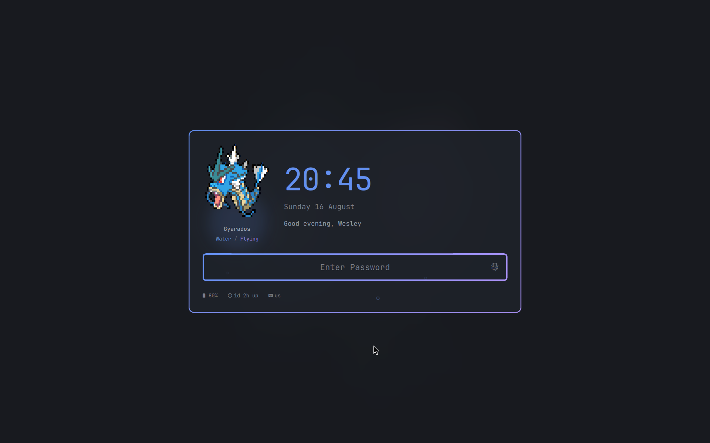

# Pokémon Lock Screen (Omarchy shell plugin)

A cloned `omarchy.lock` for [Omarchy](https://omarchy.org/) 4's Quickshell shell.
Same PAM flows as the stock lock screen (password + fingerprint, untouched), with
the view rebuilt: a Pokémon sprite greeting, a big clock, a personal greeting and
a status strip, all driven by theme tokens.



## What it adds

One card over the blurred wallpaper: sprite on the left, time and greeting on
the right, password field across the bottom, status in the footer.

- **Pokémon sprite** rendered from [`pokemon-colorscripts`](https://gitlab.com/phoneybadger/pokemon-colorscripts)
  ANSI art, converted to rich text (`Ansi.js`). A fresh random one per lock, or
  pin one by name. Missing binary = no sprite, no error.
- **The Pokémon's types drive the chrome.** Its primary type colors the clock,
  the glow behind the sprite and both borders; a dual type turns the borders
  into a two-stop gradient, and the type line under the name spells it out.
- **A distinct ambient effect for all eighteen types** — no two share one.
  Embers, bubbles, leaves, flakes, wisps, twinkles, smog, grit, gusts,
  lightning strikes, shockwave rings, psychic ripples, orbiting rubble, a
  dragon vortex, dark pools, steel plates, bug flit and dust motes. Three also carry a trait on
  top: flying hovers the sprite, electric flicks the card edge, ground rumbles
  the card. Dual types layer the second type's effect behind the first.
- **Clock, date and greeting** — the greeting follows the time of day, or takes a
  literal line with `{name}` / `{pokemon}` placeholders.
- **Status footer**: battery, uptime, keyboard layout. Each entry disappears when
  its source has nothing to say.
- **Wrong-password shake** of the whole card.
- **Follows the active Omarchy theme.** The card fill is the theme background
  mixed toward the theme accent, the wash over the wallpaper is theme-colored
  rather than black, and the text comes from the theme's own `[lock]` tokens —
  so a theme switch restyles the lock screen with no per-theme configuration.



Type data ships with the plugin (`types.json`, generated from PokéAPI), so the
lock screen never touches the network. Everything is optional and every value
is a token — see below.

## Install

```bash
git clone https://github.com/WSeubring/omarchy-lock-pokemon ~/.config/omarchy/plugins/wseubring.lock
omarchy plugin disable omarchy.lock
omarchy restart shell
```

The plugin id is `wseubring.lock`; rename the directory *and* `id` in
`manifest.json` together if you want your own namespace.

Optional but recommended:

```bash
yay -S pokemon-colorscripts-git
```

Preview it without locking:

```bash
qs -p /usr/share/omarchy/shell ipc call lock preview
qs -p /usr/share/omarchy/shell ipc call lock hidePreview
```

## Theming

Every knob reads `[lock]` in shell.toml, which the shell assembles from the
current theme's generated file with `~/.config/omarchy/shell.toml` merged on
top. So a theme owns the look, and the machine-level file overrides any single
key without touching the theme:

- theme-scoped: `~/.config/omarchy/themes/<slug>/shell.lock.toml`
  (a full-section override — repeat every key of `[lock]`, it replaces the block)
- machine-wide: `~/.config/omarchy/shell.toml` under `[lock]`

Unset keys fall back to palette-derived defaults, so the plugin still looks
right under a theme that says nothing about the lock screen.

| Key | Default | Meaning |
| --- | --- | --- |
| `clock`, `date`, `greeting`, `status`, `pokemon`, `pokemon-label` | `show` | Section toggles (`show`/`hide`) |
| `clock-format`, `date-format` | `HH:mm`, `dddd d MMMM` | Qt date formats |
| `clock-size`, `date-size`, `greeting-size`, `status-size` | from the `[font]` scale | px |
| `clock-color`, `date-color`, `greeting-color`, `status-color` | `text` / `placeholder` | hex, role name, or a `section.key` reference; a gradient reference uses its first stop |
| `user-name` | GECOS, else login name | Name used in the greeting |
| `greeting-text` | time-of-day greeting | Literal line; `{name}` and `{pokemon}` are substituted |
| `status-items` | *(empty)* | Extra strip entries: `uptime`, `keyboard` (battery is the HP bar) |
| `battery-style` | `hp-bar` | `hp-bar`, `text` (in the strip), or `hide` |
| `hp-colors` | `hp` | `hp` for the games' green/yellow/red, `theme` for the accent |
| `status-gap`, `status-margin` | `26`, `48` | px |
| `pokemon-name` | random | Pin a Pokémon (`pikachu`) |
| `pokemon-generations` | all | `pokemon-colorscripts` range syntax, e.g. `1-3` |
| `pokemon-shiny` | `false` | Shiny sprites |
| `pokemon-size` | `12` | Glyph px for the sprite |
| `pokemon-height` | `170` | px the sprite is scaled to fit |
| `pokemon-types` | `show` | Type colors on clock, glow and borders |
| `pokemon-effects` | `show` | Ambient motion, sprite bob, border flicker |
| `effect-intensity` | `1.0` | Scales the number of ambient shapes (`0` = none) |
| `effect-variant` | `1` | `1` calm, `2` busy, `3` bold; per effect with `effect-variant-<name>` |
| `effect-<type>` | per type | Point a type at another effect, e.g. `effect-electric = "sparks"` |
| `dual-effects` | `show` | Layer the second type's effect behind the first |
| `dual-effect-strength` | `0.55` | Density of that second layer |
| `layout` | `card` | Where the clock sits: `card`, `clock-above`, `hero`, `ghost`, `corner` |
| `ghost-opacity`, `ghost-scale` | `0.2`, `3.4` | Watermark clock in `ghost` layout |
| `card-tint` | `0.14` | How much of the active theme's accent is mixed into the card fill |
| `tint-source` | `theme` | `theme` uses the Omarchy accent, `type` uses the Pokémon's |
| `card-glow` | `0` | Halo of the tint color bled out behind the card |
| `scrim-color` | theme background | The wash over the wallpaper; theme-colored so light themes stay bright |
| `border-emphasis` | `card-quiet` | How the card ranks against the field: `even`, `card-quiet`, `soft-card`, `split`, `state` |
| `card-width` | `min(720, 55%)` | px |
| `card-padding`, `card-alpha` | `30`, `0.82` | Card inset and opacity |
| `field-height` | `60` | Password field height (it spans the card) |
| `blur` | `1.0` | `0` leaves the wallpaper sharp |
| `scrim-alpha` | `0.5` | `0` removes the darkening wash |

Stock `[lock]` color keys (`background`, `text`, `placeholder`, `text-error`,
`border`, `border-active`, `border-error`, `border-alpha`, `selection`) keep
working as they do on the built-in lock screen. Pointing `border` at
`hyprland.active-border` gives the field the theme's window-border gradient.

### Example

```toml
[lock]
greeting-text = "{pokemon} welcomes you back, {name}"
pokemon-generations = "1-3"
status-items = "battery keyboard"
scrim-alpha = 0.35
```

## Keeping up with upstream

This is a clone of Omarchy's `omarchy.lock`, so `Service.qml` (session lock,
PAM, fingerprint, idle handling) is upstream code carried verbatim. When Omarchy
updates its lock plugin, diff and reapply:

```bash
diff -u /usr/share/omarchy/shell/plugins/lock/Service.qml Service.qml
```

`LockView.qml`, `Ansi.js`, `Types.js`, `Ambient.qml` and `types.json` are the
parts that are actually mine.

`types.json` maps every name `pokemon-colorscripts` knows to its types. To
regenerate it after a new generation lands:

```bash
for i in $(seq 1 18); do curl -s "https://pokeapi.co/api/v2/type/$i" -o "type-$i.json"; done
# then fold the per-type pokemon lists into {name: [type, ...]}
```
